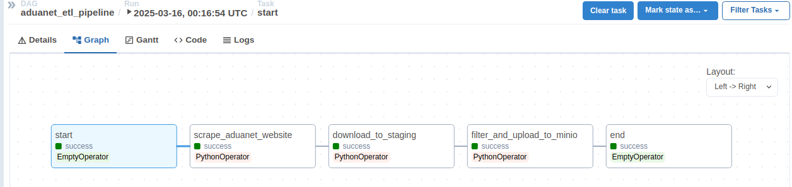

## Reporte para el Análisis de estudios de mercado en segmentos.
[](https://github.com/programmingwithclaudio/ia_chat_langchain)
[](https://github.com/programmingwithclaudio/ia_chat_langchain)

Este proyecto implementa una arquitectura de datos completa que orquesta el proceso de scraping, staging y carga a MinIO como `DATALAKE` utilizando Airflow. 
- **Objetivo**: Automatizar un flujo de análisis de estudios de mercado para las importaciones en Perú. Se actualizará cada 15 días.
---
### Flujo de operaciones en la Orquestación con Airflow



- **Scraping y Extracción:**  
  Se utiliza **Selenium** y **BeautifulSoup** para extraer dinámicamente los enlaces de archivos ZIP de la web de Aduanas.

- **Staging y Persistencia:**  
  Se implementa temporalmente un directorio de staging y se registra su metadata (nombre, URL, fecha, estado y rutas de staging/MinIO) en una base de datos PostgreSQL mediante **psycopg2**.

- **Carga a MinIO:**  
  Utilizando **boto3**, los archivos validados se suben a un bucket en MinIO para un almacenamiento centralizado `DataLake`, 

- **Orquestación con Airflow:**  
  Todo el flujo está orquestado mediante un DAG de Airflow que coordina las tareas de scraping, descarga y carga, garantizando robustez, escalabilidad y manejo de fallos a través de políticas de reintentos y control de estados.

- **Despliegue y Escalabilidad:**  
  La infraestructura se levanta con Docker Compose, integrando servicios clave (Postgres, Redis, MinIO, Kafka, Spark) para soportar un ecosistema de datos distribuido y listo para pipelines ETL avanzados.

- Esta solución permite la integración de datos desde fuentes web, su validación y almacenamiento centralizado, sirviendo como base para procesos de análisis y transformación de datos en entornos empresariales.

- Requisitos:
   - Git
   - Docker, Docker-Compose
   - Linux o Windows con (WSL)
- Nota: ArchiLinux +XFCE (Desktop) la mejor distribución

- Comandos del proyecto:
   ```bash
   docker-compose up -d postgres redis minio zookeeper kafka
   docker-compose up -d airflow-init airflow-webserver airflow-scheduler
   docker-compose up -d spark-master spark-worker
   chmod +777 init.sh
   ./init.sh
   ```
---
### Referencias

- "Designing Data-Intensive Applications" (Martin Kleppmann, 2017)

- "Streaming Systems: The What, Where, When, and How of Large-Scale Data Processing" (Tyler Akidau et al., 2018)
